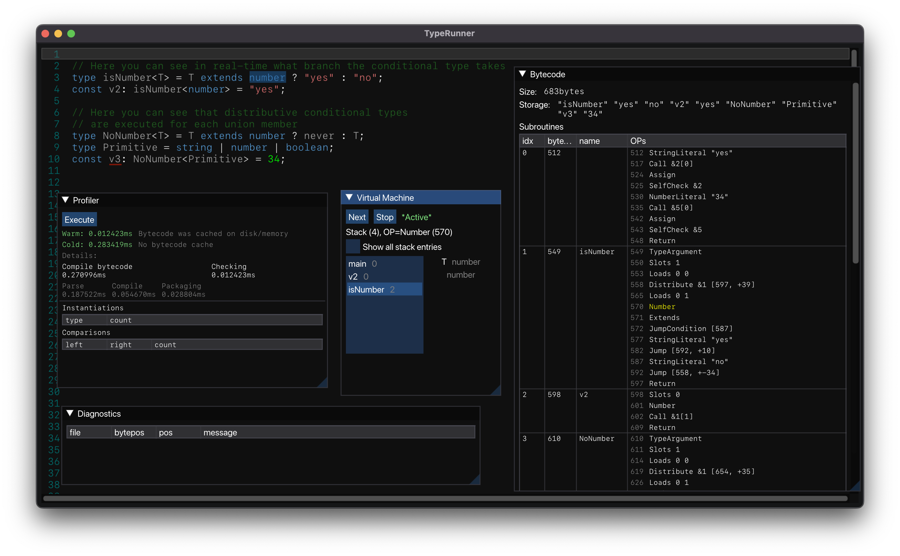

# TypeRunner

<p align="center">

</p>

<p align="center">
High-performance TypeScript compiler.
</p>

## Goal

- Parser
- Type checking (as CLI and as library)
- Language Server
- Interactive type debugging
- Type information in other languages
- (optional) transpiling to JavaScript
- (optional) RTTI in JavaScript
- (optional) type profiler

The goal is to make TypeScript type checking as fast as possible and provide alongside with it a native library for other languages, so they can use TypeScript type information
without the need for a JavaScript engine for all sorts of use cases like JSON-Schema replacement, ORM DSL, encoding information (like Protocol Buffers schema) and more.

The goal is not to be a drop-in replacement for the entire official TypeScript compiler (tsc). TypeScript supports so much that is not always necessary. 
We focus on the more strict TS part which means TypeRunner won't support JSDoc and a lot of compiler options.  

## Status

The source code in the initial version is really only a proof of concept. It consists of roughly 30k LoC and shows very promising results.
The approach is a TS-to-bytecode compiler and then run the bytecode in a custom virtual machine.
The data show that this approach can lead to a hundred- to several-thousand-fold improvement in speed.



Once the project gets funding through the community, the development will continue.

## Performance

`TypeRunner cold` means the file was seen for the first time and has to be compiled to bytecode first.
`TypeRunner warm` means the bytecode could be directly executed because it was cached. Generally it is assumed
that only a few files change, for example if you have a project with 100 files and edit one and then rerun 
type checking, then only the changed one has the slower `cold` timing. Note that compilation has not yet been optimised 
(it still uses a slow memory allocator which can be improvement roughly tenfold). 

Note that `tsc` numbers are after 10 iterations (the JavaScript engine V8 JIT optimises it early already), which somewhat
leads to a wrong conclusion. Only 1 iteration is 10x slower and a cold `tsc` start even slower because of the initial bootstrap
delay of several hundred milliseconds. So you can generally assume that `tsc` is slower than the numbers shown below.

### Basic variables

```typescript
const v1: string = "abc";
const v2: number = 123;
```

```
TypeScript tsc:  0.8ms
TypeRunner cold: 0.004688500ms (170x faster)
TypeRunner warm: 0.000079584ms (10,052x faster)
```

### Generic function

```typescript
function doIt<T extends number>(v: T) {
}
const a = doIt<number>;
a(23);
```

```
TypeScript tsc:  1.4ms
TypeRunner cold: 0.014966250ms (93x faster)
TypeRunner warm: 0.000181875ms (7,697x faster)
```

### Object literal type

```typescript
type Person = {name: string, age: number}

const a: Person = {name: 'Peter', age: 52};
const b: Person = {name: 'Peter', age: '52'};
```

```
TypeScript tsc:  1.5ms
TypeRunner cold: 0.009106375ms (164x faster)
TypeRunner warm: 0.000836959ms (1,795x faster)
```

### Complex type

```typescript
type StringToNum<T extends string, A extends 0[] = []> = `${A['length']}` extends T ? A['length'] : StringToNum<T, [...A, 0]>;
const var1: StringToNum<'999'> = 999;
```

```
TypeScript tsc:  350.2ms
TypeRunner cold:   0.862534792ms (406x faster)
TypeRunner warm:   0.839308334ms (417x faster)
```

## FAQ

### Why?

TypeScript is cool and all, but also very slow and not usable in other languages. We want to make it fast and type computation accessible to all languages.

We believe that TypeScript can be much faster. There are a lot of workarounds used these days to work around the slow type checking of TypeScript. 
Some "TypeScript runtimes" even entirely disable type checking (and thus the key selling point of TypeScript) per default and rely on suboptimal editor-only type checking 
(which is still slow). We think it is possible to build a TypeScript compiler that is so fast, that you can run TypeScript files directly with all its type checking features
enabled and still having almost instant compile time.

We also believe that TypeScript is more than just a linter. It is a language that is so powerful and can be used for so much more.
Imagine for example to write a schema like the following and be able to validate data against it in any language, no matter if JavaScript, C++, C, Rust, or Go.

```typescript
export interface User {
    id: number & PrimaryKey;
    name: string & MinLength<3>;
    password: string;
}
export type ReadUser = Omit<User, 'password'>
export type CreateUser = Omit<User, 'id'>;
```

With TypeRunner this will be possible and thus has the potential to replace JSON schema with a much more powerful way of defining schemas.
It doesn't stop with JSON schema however: ORM, GraphQL, gRPC, Protocol buffer, and many more technologies that rely on schema information can rely
on the powerful TypeScript type system to increase usability and efficiency dramatically. This brings isomorphic TypeScript to a whole new level.

### Why doesn't Microsoft implement it like this?

Microsoft had (or still has) as goal to get a good and wide adoption of TypeScript. That means to find product-market fit and improve UX, iteration speed is key to success.
Writing high-performance code usually impacts these goals negatively.

Also, implementing features to make adoption easier and [dogfooding](https://en.wikipedia.org/wiki/Eating_your_own_dog_food) are important strategies to make sure 
the product you're building actually will be adopted and solves real problems. Since the TypeScript team doesn't have unlimited resources this means however that
they have to focus on what brings growth. Performance is not something that brings much growth, especially if you take into consideration that the market 
expands every 4 years or so by 100%, which means that most developers are beginners and have other priorities than performance.

Strategically speaking it makes thus sense for Microsoft to develop TypeScript the way they do it, at least for the moment.

### Why not a drop-in replacement for `tsc`?

TypeScript offers a lot of functionality. Many things are targeted at a smooth transition from JavaScript to TypeScript
by allowing not-so-strict syntax and alternative type declaration syntax like JSDoc. Although these features
have a big impact on new TypeScript users they are not so much used in projects where TypeScript is used more strictly.
TypeScript comes also with a fairly big variety of transpilers/transformers to generate JavaScript for all kind of ECMAScript standards.
We think that although these features have a big value for new users and adoption, we want to focus more on the enterprise side of things, where
performance often translates directly to money.

### What is currently supported?

Only very basic type expressions are currently supported: primitives, variable declaration, (generic) function declaration, 
some type functions like type aliases, (distributive) conditional types, template literals, array/tuples, index access, union, rest, and a few other things.
They are implemented in a very rough way just enough to proof that the language in its core can be implemented in a fast way.

### When will it be released?

Currently, the development of TypeRunner is almost stalled and was more an experiment/proof of concept. To actually make this a reality, funding is necessary.
In the next coming weeks, we will set up a kickstarter/funding project, which makes it possible for the community that is interested in high-speed TypeScript to
make this a reality.

### Why C++ and not Rust?

Because I know C++ much better than Rust. The market of good C++ developers is much bigger. TypeScript code also maps surprisingly good to C++, so porting
the scanner, parser, and AST structure is actually rather easy, which allows back-porting features from TypeScript tsc to TypeRunner much better. I also find Rust ugly.

### Why not port TypeScript?

Porting TypeScript alone to a faster language won't yield much performance difference since the V8 JIT optimises TypeScript compiler already good enough and the
current slowdown comes mainly from architectural decisions made to work well in a JavaScript runtime (where optimisation strategies are very limited). 
To get a much faster compiler you have to do both, use a fast compiling language and use an architecture that utilizes all performance advantages of that language.

That being said, in the current stage the actual TypeScript scanner/parser code is ported from the TypeScript compiler to make back-porting easier.
It's also at the moment the most complicated and slowest code (with over 20k LoC), which will be improved in the future.

### What can I do to support this project?

Follow me on Twitter and fund it once the funding campaign is published: [twitter.com/MarcJSchmidt](https://twitter.com/MarcJSchmidt)

### How does it work/Why is it so fast?

It is so fast because it does the heavy-lifting only once per file and optimised the type computation/comparison in a custom virtual machine.

The compiler consists of 3 stages: Parsing to AST, compiling to bytecode, and executing the bytecode in a virtual machine.
The first two stages are the most expensive ones and have to be done for each file once. The resulting bytecode can then be cached on disk.

The compiler has a simple data-flow analysis implemented to generate more efficient bytecode 
(like tail call/tail rest detection, and detecting usage of potential usage of super instructions).
It also tries to precompute as much as possible: for example all literal values will have in the bytecode header a precomputed 64bit hash, 
so that the virtual machine can compare literal types with a simple integer comparison and use it in hash-tables.

The stack based virtual machine tries to be lightweight and high-performant as the most work happens here. 
It uses multiple memory pools with garbage collection, fix-sized type structure, tail call optimisation, tuple re-use (tail rest optimisation).
For list structured linked lists and hash-tables (based on precomputed literal hash) are used to make lookups very fast.

The instruction set consists of currently 83 instructions: https://github.com/marcj/TypeRunner/blob/master/src/checker/instructions.h
and will likely grow in the future.

## Development

TypeRunner is written in modern C++ with cmake, doctest, imgui, tracy, fmt. To work on this project first clone the repository:

```sh
$ git clone git@github.com:marcj/TypeRunner.git
$ cd TypeRunner
$ git submodule update --init --recursive
```

To compile using Docker:

```sh
$ docker build -t typerunner -f Dockerfile .
$ docker run typerunner build/bench tests/objectLiterals1.ts
```

To compile natively make sure cmake and a C++ compiler is installed. We use LLVM toolchain per default. To build the project run the usual cmake command:

```sh
$ mkdir build
$ cd build
$ cmake -DCMAKE_CXX_COMPILER=clang++-14 -DCMAKE_C_COMPILER=clang-14 -DCMAKE_BUILD_TYPE=Release ..
$ make bench -j 8
$ ./bench ../tests/objectLiterals1.ts
```

Now you find in the build folder some binaries you can execute.